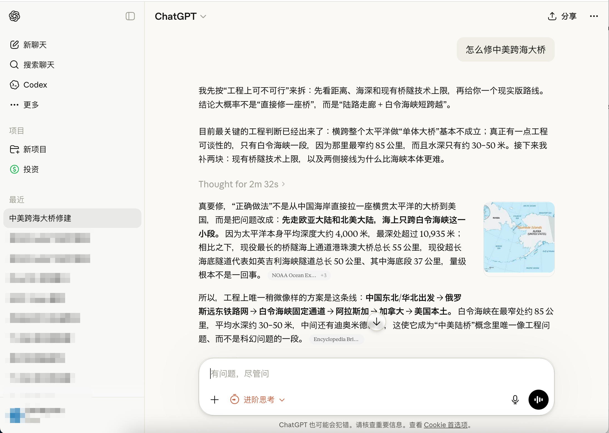

<p align="center">
  
</p>

# Cloakd

**语言：** [English](README.md) · 简体中文

**把 ChatGPT 的网页端伪装成 Claude.ai。** Plasmo 浏览器扩展，纯 CSS 注入 —— 不动 DOM、不注入 React、加载一次不再执行。

- 暖奶油底色 / 铜橙 accent
- Anthropic Sans 做 UI,Anthropic Serif 做助手回复（和 claude.ai 一致）
- 圆角气泡、悬浮 / 选中态匹配 Claude 的交互反馈
- 浅色 / 深色模式自动跟随 ChatGPT 自身设置
- 所有可调参数抽成 CSS 变量,调优只改 3 个文件
- 扩展 popup 里按产品独立开关
- 附带 [`claude-communication-style-guide.md`](claude-communication-style-guide.md) —— 把 Claude 的*声音*也做成 prompt,和视觉伪装配套

> ⚠️ 个人折腾项目。目前只支持 ChatGPT (`chatgpt.com` / `chat.openai.com`)。Gemini 版本计划中,未开工。

---

## 安装

两条路,按需选一。

### 普通用户 —— 下载 zip

Chrome 从 v75 起拒绝任何本地 `.crx` 文件,错误是 `CRX_REQUIRED_PROOF_MISSING`(必须有 Web Store 签发的安装来源证明,我们没有)。所以 Cloakd 发布的是 `.zip`,你解压后用 Chrome 的"开发者模式 → 加载已解压的扩展"来装。效果完全一样,只是载体不同。

1. 在 [Releases](https://github.com/Janlaywss/cloakd/releases/latest) 里下载 `cloakd-v<version>.zip`
2. 解压到一个**永久位置**。这个文件夹必须留在原地 —— Chrome 记的是加载时的绝对路径,你删掉或移动它扩展就失效。

   ```sh
   mkdir -p ~/Applications/cloakd
   unzip cloakd-v*.zip -d ~/Applications/cloakd
   ```

3. 打开 `chrome://extensions`
4. 右上角打开 **开发者模式**
5. 点 **加载已解压的扩展程序**,选刚才解压的文件夹
6. 访问 https://chatgpt.com,应该立刻看到 Claude 风格的界面

**升级**:下载新版本的 zip,**覆盖解压到同一个文件夹**,然后在 `chrome://extensions` 里点 Cloakd 卡片上的 ↻ 刷新图标即可。不需要先移除再添加。

**关于"关闭开发者模式"的提示条**:Chrome 每次启动,只要有开发者模式加载的扩展就会弹一个条横幅,点 **取消** / **保留** (具体文案看版本)即可。这是所有非 Web Store 扩展都会有的,正常现象。

### 贡献者 —— 从源码构建

先决条件:Node 20+ 和 pnpm。

```sh
pnpm install     # 大约 9 秒
pnpm build       # 生产构建 → build/chrome-mv3-prod/
# 或
pnpm dev         # watch 模式 → build/chrome-mv3-dev/
```

然后在 `chrome://extensions` 里用 **加载已解压的扩展程序** 选 `build/chrome-mv3-prod/` 或 `build/chrome-mv3-dev/`。

开发模式下改任何 CSS / TS 文件 Plasmo 都会自动 rebuild。之后在 `chrome://extensions` 点 Cloakd 卡片的 ↻ 刷新图标,再硬刷 chatgpt.com (⌘⇧R / Ctrl+Shift+R) 就能看到变化。

> **关于 `sharp@0.33` override**:项目通过 `pnpm.overrides` 把 sharp 强制升到 0.33.x,避开旧版 sharp 0.32 从 GitHub release 下载 libvips 的坑 —— 那个在国内基本必超时。详见 [AGENT.md](AGENT.md) Gotcha #1。

---

## 按产品开关

点 Chrome 工具栏里 Cloakd 图标打开 popup,每个支持的产品都有独立的开关:

```
┌────────────────────────────────┐
│ Cloakd                         │
│ Claude-style reskin            │
│────────────────────────────────│
│ ChatGPT                  [●━━] │  ← 开
│ chatgpt.com                    │
│                                │
│ Gemini                  ┌────┐ │  ← 暂未支持
│ gemini.google.com       │SOON│ │
│                         └────┘ │
│────────────────────────────────│
│ Changes apply instantly.       │
└────────────────────────────────┘
```

切换立即生效,**不需要刷新页面**。状态存在 `chrome.storage.sync` 里,同一 Chrome 账号跨设备同步。

---

## Claude 的声音 (bonus)

Cloakd 负责给 ChatGPT 换上 Claude 的*脸*。至于 Claude 的*声音*,仓库里还提供了 [`claude-communication-style-guide.md`](claude-communication-style-guide.md) —— Claude 沟通哲学的 10 条原则精炼:

1. **语气** —— 温暖但直接;不兜圈子,也不冷冰冰
2. **结构** —— 散文优先,列表要"赚得到"才用
3. **校准** —— 看人下菜;别跟专家讲基础,也别对新手摆架子
4. **诚实** —— 不知道就说不知道;区分事实 / 推断 / 意见
5. **情绪基线** —— 稳定而非扁平;拒绝空洞的热情
6. **经济** —— 每句话都要挣到自己的位置;不复述,不废话
7. **观点** —— 要有立场,用推理捍卫,接受被说服
8. **语言** —— 干净、精确、自然;不用 AI 腔和企业黑话
9. **错误处理** —— 承认、修正、继续前进,不自责过度
10. **元原则** —— 做有用的事,做真实的事;把读者当成聪明的成年人

### 怎么用

把 [`claude-communication-style-guide.md`](claude-communication-style-guide.md) 整个复制到 **ChatGPT → 设置 → 个性化 → Custom instructions → "你希望 ChatGPT 如何回应？"** 里(或者你用的 Cursor / LibreChat / Claude desktop 里对应的字段)。配合 Cloakd 的视觉伪装,ChatGPT 就会看起来、听起来都像 Claude。

这份文档本身独立可用 —— 不装扩展也能用,或者 fork 一份当你自己 AI persona prompt 的基底。

---

## 如何调主题

所有可调参数都在 `styles/chatgpt/` 目录下的三个 CSS 文件里。

| 文件 | 改它会影响 | 里面有什么 |
|---|---|---|
| [`styles/chatgpt/light.css`](styles/chatgpt/light.css) | 只浅色模式 | 所有浅色 token (颜色、阴影、边框) |
| [`styles/chatgpt/dark.css`](styles/chatgpt/dark.css) | 只深色模式 | 同名 token 的深色版本 |
| [`styles/chatgpt/base.css`](styles/chatgpt/base.css) | 两种模式共享 | 字体栈、圆角、过渡、以及所有选择器 (选择器都用 `var(...)` 读 token,不硬编码颜色) |

**原则**:要改颜色 / 阴影 → 去 `light.css` 或 `dark.css`。要改字体 / 圆角 / 过渡 → 去 `base.css`。要改"哪个元素用哪个 token" → 去 `base.css` 的下半部分。

### 常见调优场景

```css
/* light.css — 想把底色换成纯白 */
--cloakd-bg: #FFFFFF;
--cloakd-bg-transparent: rgb(255 255 255 / 0);  /* 记得同步这个 */

/* base.css — 想让用户气泡也用 serif */
--font-user-message: var(--font-ui-serif);

/* base.css — 觉得气泡圆角太方 */
--cloakd-radius-bubble: 20px;

/* light.css + dark.css 都要改 — 把 accent 换成别的色 */
--cloakd-accent: #6C63FF;
--cloakd-accent-hover: #5850E0;
--cloakd-accent-soft: rgba(108, 99, 255, 0.12);
```

改完之后 `pnpm dev` 会自动 rebuild,然后点扩展刷新 + 页面硬刷即可。

### Token 命名

两套 token,两种职责:

- **`--cloakd-*`** —— 这个项目自己的语义 token (`--cloakd-bg`, `--cloakd-accent`, `--cloakd-radius-bubble` 等)。选择器都读这些。
- **`--font-*`** —— 字体相关的 token,完全镜像 Claude.ai 自己用的变量名 (`--font-ui`, `--font-ui-serif`, `--font-user-message`, `--font-claude-response`, `--font-anthropic-sans/serif/mono` 等)。这样将来从 Claude.ai 直接复制 CSS 片段过来就能用。

---

## 目录结构

```
cloakd/
├── AGENT.md                              AI 助手使用的项目上下文文档
├── README.md                             英文主文档
├── README.zh-CN.md                       这个文件
├── claude-communication-style-guide.md   Claude 的声音,以 prompt 形式
├── before.png                            首屏截图
├── package.json
├── tsconfig.json
├── popup.tsx                             扩展 popup (React) — 每个产品一个开关
├── popup.css
├── assets/
│   ├── icon.png                          512×512 占位图标（随时替换）
│   └── fonts/
│       ├── anthropic-sans.woff2          Anthropic Sans Web Regular
│       └── anthropic-serif.woff2         Anthropic Serif Web Regular
├── contents/
│   └── chatgpt.ts                        content script:注入 @font-face + 三个 CSS 文件
├── styles/
│   └── chatgpt/
│       ├── base.css                      字体 / 几何 / 选择器
│       ├── light.css                     浅色 tokens
│       └── dark.css                      深色 tokens
└── .github/workflows/
    └── release.yml                       合并到 release 分支时自动构建 + 发布 .zip
```

---

## 字体

两个 woff2 通过 Plasmo 的 `data-base64:` 导入方式直接内联进 content script bundle:

```ts
// contents/chatgpt.ts
import anthropicSans  from "data-base64:~assets/fonts/anthropic-sans.woff2"
import anthropicSerif from "data-base64:~assets/fonts/anthropic-serif.woff2"
```

**为什么要内联**:content script 注入的 `<style>` 里的 `@font-face { src: url(...) }` 没法直接读扩展自身的文件 (需要走 `web_accessible_resources` + `chrome.runtime.getURL()` 动态重写 CSS),麻烦且有首屏闪烁。base64 内联代价是 bundle 从 12KB 涨到 403KB,但 Chrome 会缓存解析后的样式表,每次 SPA 导航都是零闪烁。

**已知限制**:
- 只装了 **Regular 400**。粗体 / italic 会落回系统字体栈的下一档 (`system-ui`),不伪粗 —— 是 `font-synthesis: none` 防止浏览器合成丑陋的 faux-bold。
- **Anthropic Mono 没装**。代码块走系统 mono (SF Mono / Menlo)。

---

## Release 自动发布

**每次合并到 `release` 分支**会触发 [`.github/workflows/release.yml`](.github/workflows/release.yml),自动:

1. 从 `package.json` 读 `version`
2. **如果 `v<version>` tag 已存在就失败** —— 提醒你 bump version
3. `pnpm install --frozen-lockfile` → `pnpm build`
4. 把 `build/chrome-mv3-prod/` 打成 `cloakd-v<version>.zip`
5. 创建 GitHub Release,tag = `v<version>`,带上 zip

### 发布流程

```sh
# 1. Bump package.json 里的 version (比如 0.0.1 → 0.0.2)
git add package.json pnpm-lock.yaml
git commit -m "release v0.0.2"

# 2. 合并到 release 分支并 push
git checkout release
git merge main
git push origin release
```

CI 接手。去 **Actions** 标签看跑状态,完事后去 **Releases** 标签下载 zip。

### 为什么不发 .crx？

Chrome 从 v75 起,自签名的 `.crx` 一律以 `CRX_REQUIRED_PROOF_MISSING` 拒绝安装(Web Store 签发的"安装来源证明"是强制的,自分发扩展拿不到)。`.zip` + Load unpacked 路径不需要任何证明,加载后状态完全一致,所以 CI 就只打 zip。

如果你真要 `.crx`(比如 Brave / Ungoogled Chromium 这类更宽松的浏览器),自己拿任意 CRX3 工具对 `build/chrome-mv3-prod/` 签名即可。不是大多数人想要的形式,CI 里就不做了。

---

## 已知限制

1. **ChatGPT 的 Tailwind class 名会变**。一些兜底选择器 (`[class*="rounded-3xl"]` 之类) 可能哪天就命中不到了。用 DevTools 检查实际 DOM,在 [`styles/chatgpt/base.css`](styles/chatgpt/base.css) 追加更精确的选择器。
2. **Plasmo 版本**。当前锁在 0.88,有新版 0.90.5 可用,升级之后可能可以去掉 sharp override —— 详见 [AGENT.md](AGENT.md)。
3. **没做过 Firefox**。只在 Chromium 系 (Chrome / Edge / Arc / Brave) 上验证过。

---

## Roadmap

- [ ] Gemini (`gemini.google.com`) 支持 — `contents/gemini.ts` + `styles/gemini/{base,light,dark}.css`
- [ ] 多字重字体 (Medium / Semibold / Bold)
- [ ] Options 页,让用户直接在扩展里调 token 而不用改文件 + 重载
- [ ] Firefox / Safari 构建

---

## 贡献 / 二次开发

看 [AGENT.md](AGENT.md) 了解项目约定、设计原则和已知的坑。它是写给 AI 助手 (Claude Code / Cursor / Copilot) 的上下文文件,同时也是最好的人类可读架构文档。
